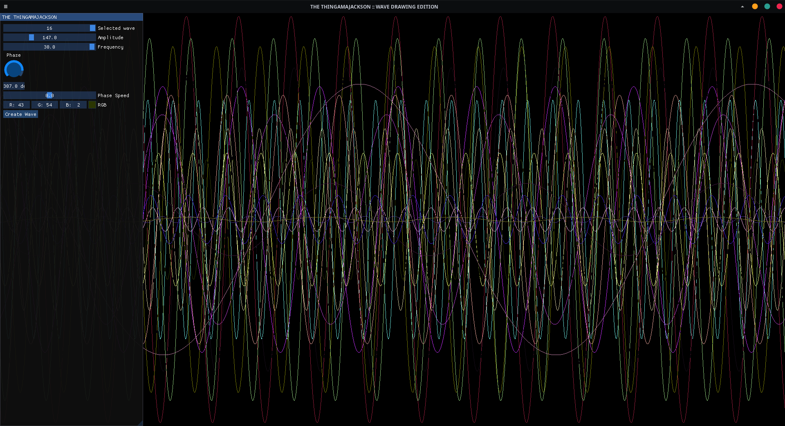

# How to install this (if for some reason you want to)
### Requirements:
- raylib
- imgui
- fmt
```
git clone https://github.com/TheGBO/thingamajackson --recurse-submodules
cd ./thingamajackson
chmod +x ./build.sh
./build.sh
```

</img>